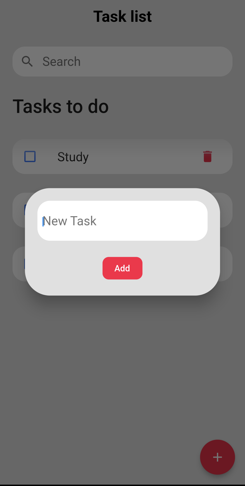
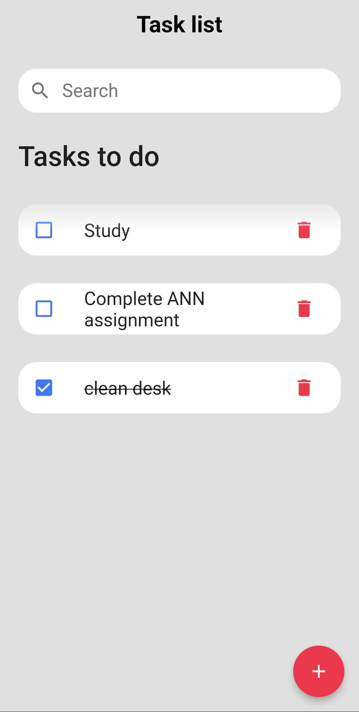

# Tasklist

Task List is an app that helps user create a to-do list. The app uses SharedPreferences to store the tasks created by the user so that whenever the user reopens the app, they can view their to-do list. The app was made using Flutter in Android Studio.

<table>
  <tr>
    <td></td>
    <td></td>
  </tr>
 </table>
